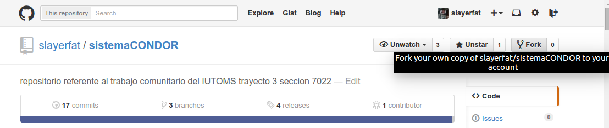

#sistemaCONDOR

###node
para usar este repositorio es necesario tener instalado en el sistema [node.js](http://nodejs.org/)
chequear que node esta instalado `node -v` el sistema dira `v0.10.*` luego chequear que npm _(node package manager)_ este en el sistema `npm -v`

###composer
tambien es necesario instalar [composer](https://getcomposer.org/)

```
curl -sS https://getcomposer.org/installer | php
mv composer.phar /usr/local/bin/composer
```

- si falla pueden `sudo !!`
- si falla porque no tienen curl
```
php -r "readfile('https://getcomposer.org/installer');" | php
mv composer.phar /usr/local/bin/composer
```

- chequear que este instalado `composer -V` el sistema dira `Composer version 1.0.-* (...) fecha`, si algo falla, chequear la documentacion de [composer](https://getcomposer.org/)

###bower

`npm install -g bower`

##fork el repositorio



###obtener las dependecias del sistema
_desde la carpeta clonada_ 

`npm install`

`bower install`

`composer install`

si composer se queja sobre mcrypt o mysql es probable que no tengan los modulos correspondentes activados/instalados

para ello deberan

`sudo apt-get install php5-mcrypt`
`sudo apt-get install php5-mysql`
`sudo apt-get install php5-gd`

si usan xampp, wampp, lampp, deberan referirse a la documentacion de php para esos paquetes, puesto que, si falla composer, es muy probable que sea debido a los binarios de PHP utilizados por su computadora.

otra opcion es copiar el archivo de composer.phar a donde estan los archivos de php de xampp.

*google es tu aliado*

si todo sale bien, debera generar las carpetas vendor/ node_modules/ y vendor/bower_components/ sumando a otras dependecias.

#sobre las dependencias

es importante destacar que cada branch puede tener diferentes dependencias, lo que implica hacer installs adicionales segun el branch.

#La base de datos

para instalar la base de datos en el sistema necesitan el archivo *.env* con la informacion de la base de datos y luego accionar:

`php artisan migrate --seed`

y listo, la base de datos esta localmente en el sistema.

si falla pueden hacer un `composer dump-autoload` y reintentarlo, si vuelve a falla puden crear un [problema (issue) en github](https://github.com/slayerfat/sistemaCONDOR/issues) con el error y la descripcion del mismo.

#Artisan

laravel viene con un CLI llamado artisan, este entre otras utilidades, sirve como interfaz para usar php como servidor local con el comando

`php artisan serve` (desde la carpeta del sistemaCONDOR)

de ese comando saldra algo como `Laravel development server started on http://localhost:8000
`

si van a localhost:8000 saldra una pagina de bienvenida.

*FELICIDADES, EL SISTEMA FUNCIONA!*

adicionalmente tiene comandos de generacion de modelos, controladores, migraciones, etc.

#Arbol de directorios simplificado

```
.
├── app
│   ├── Http
│   │   ├── Controllers
│   │   │   └── [Los Controladores]
│   │   ├── Middleware
|   |   |   └── [Las Autentificaciones y otros]
│   │   ├── Requests
|   |   |   └── [las Validaciones]
|   |   └── [El Router]
|   └── [Los Modelos]
├── config
│   └── [La configuracion del sistema]
├── database
│   ├── migrations (la base de datos)
│   └── seeds (los datos)
├── node_modules
│   └── [Dependencias]
├── public
│   ├── js y otros
│   ├── css
│   └── [los archivos al publico]
├── resources
│   ├── assets
│   ├── lang
|   |   ├── [Futura capeta de es_ve]
│   │   └── en
│   └── views
│       └── [Las Vistas]
├── storage
│   └── logs (errores)
├── tests (las pruebas)
└── vendor
    └── [Las Dependencias]
```

##Laravel PHP Framework

este sistema usa el framework Laravel de PHP [documentacion](http://laravel.com/docs/5.0)

###License

The Laravel framework is open-sourced software licensed under the [MIT license](http://opensource.org/licenses/MIT)
